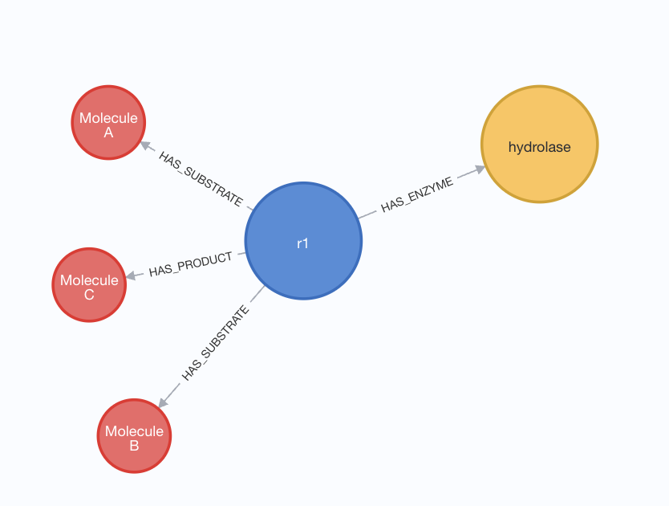

# AI-Assisted Data Management Application

An AI-assisted data management application with a Neo4j database backend and a Next.js frontend.

## Table of Contents
- [Prerequisites](#prerequisites)
- [Setup & Installation](#setup--installation)
- [Spreadsheet Organization](#spreadsheet-organization)
  - [Basic Structure](#basic-structure)
  - [Data Types](#data-types)
  - [Relationships](#relationships)
- [Features](#features)
  - [Chat with your data](#chat-with-your-data)
- [Accessing the Services](#accessing-the-services)
- [Troubleshooting](#troubleshooting)
  - [Windows](#windows-1)
  - [macOS](#macos)
  - [Common Issues](#common-issues)

## Prerequisites

- [Docker Desktop](https://www.docker.com/products/docker-desktop/)
- [OpenAI API Key](https://platform.openai.com/docs/overview) (for LLM features)

## Setup & Installation

### macOS/Linux

1. Clone or download the repository:
   ```bash
   git clone https://github.com/haeussma/carin-db.git
   cd carin-db
   ```
   Or download the ZIP:
   ```bash
   cd ~/Downloads
   unzip carin-db-main.zip
   cd carin-db-main
   ```

2. Set up environment variables:
   ```bash
   # Copy the example environment file
   cp .env.example .env
   
   # Edit the .env file to add your OpenAI API key
   nano .env  # or use any text editor
   ```
   Add your OpenAI API key to the `.env` file:
   ```
   OPENAI_API_KEY=your-api-key-here
   ```

3. Start the application:
   ```bash
   docker-compose up -d
   ```

### Windows

1. Clone or download the repository:
   - Download the ZIP file from [GitHub](https://github.com/haeussma/carin-db/archive/refs/heads/main.zip)
   - Extract the ZIP file to your desired location
   - Open Command Prompt or PowerShell in the extracted folder

2. Set up environment variables:
   ```powershell
   # Copy the example environment file
   copy .env.example .env
   
   # Edit the .env file to add your OpenAI API key
   notepad .env  # or use any text editor
   ```
   Add your OpenAI API key to the `.env` file:
   ```
   OPENAI_API_KEY=your-api-key-here
   ```

3. Start the application:
   ```powershell
   docker-compose up -d
   ```

## Accessing the Services

Once the application is running, you can access:

- Frontend: [http://localhost:3000](http://localhost:3000)
- Neo4j Browser: [http://localhost:7470](http://localhost:7470)
- Backend API: [http://localhost:8000](http://localhost:8000)

Or through Docker Desktop:
1. Open Docker Desktop
2. Go to "Containers"
3. Find "carin-db"
4. Click the port numbers to open in browser

To stop the application:
```bash
docker-compose down        # Stop services
docker-compose down -v     # Stop and remove data
```

## Spreadsheet Organization

To ensure your data is properly processed, follow these guidelines when organizing your spreadsheet:

### Basic Structure
- Spread your data into multiple sheets.
- Each sheet should represent a distinct type of data (e.g., "Enzyme", "Molecule", "Reaction")
- Use clear, descriptive column names
- Keep data clean and consistent
- Avoid special characters in column names
- Remove any leading/trailing whitespace from text data

- If there is no data for a particular cell, leave it blank.
- If you want that a particular column should only have unique values, name the column in all capital letters (e.g., "SAMPLE_ID", "ENZYME_ID")

### Data Types
- Keep data types consistent within columns:
  - Text columns should contain only text
  - Number columns should contain only numbers
- Avoid mixing data types in the same column (e.g., `1.4 mmol/L` is discouraged. Split it into two columns: representing the value and unit)

### Relationships
- To connect data between sheets, use matching values in key columns
- For one-to-many relationships, use comma-separated values in the reference column

#### Example

Consider the following example. We investigated two enzymes catalyzing different reactions with different substrates and products. We organized the different aspects of the data into different sheets `Reaction`, `Enzyme`, and `Molecule` within the same spreadsheet.

**Sheet: `Reaction`**

| REACTION_ID | has_substrate   | has_product | has_enzyme | yield_percentage | reaction_time | time_unit | 
|-------------|------------------|--------------|------------|------------------|----------------|------------|
| r1          | Molecule A, Molecule B     | Molecule C        | hydrolase       | 50            | 10         | h          |
| r2          | Molecule B, Molecule C     | Molecule D        | oxidoreductase  | 70            | 15         | h          |

**Sheet: `Enzyme`**

| ENZYME_ID | name        | expression_organism |
|-----------|-------------|---------------------|
| Enz_1     | hydrolase    | Escherichia coli     |
| Enz_2     | oxidoreductase    | Pseudomonas aeruginosa |

**Sheet: `Molecule`**

| MOLECULE_ID | name        | inchi_key   |
|-------------|-------------|-------------|
| Mol_A       | Molecule A  | InChIKey_1  |
| Mol_B       | Molecule B  | InChIKey_2  |
| Mol_C       | Molecule C  | InChIKey_3  |
| Mol_D       | Molecule D  | InChIKey_4  |

**Define Relationships**

- `Reaction`:has_substrate -> `Molecule`:name
- `Reaction`:has_product -> `Molecule`:name
- `Reaction`:has_enzyme -> `Enzyme`:name

This creates a graph in the database. In case of reaction r1, all associated information is connected in the following way:


## Features

### Chat with your data
You can ask any question on your data in natural language.
```md
Look at my reaction data for r2, r4, r10, and r20. I need a data science report covering the following questions:

- What are the substrates and products of these reactions? Draw a clear reaction scheme. 
- Is the enzyme the same in all cases?
- For which measurement did we observe the highest activity? 
- Also, provide the corresponding raw measurements on which the activity is based.
- Which reaction showed the highest overall activity, when averaging all observed values?
- Which reaction had the lowest average standard deviation of activity?
- Did the reactions differ in how the cell disruption process was carried out for each biocatalyst?
```

**Response**
```md
# Data Scientific Report

## Reaction Scheme

- **r2**  
  - Substrates: dihydro coumaric acid  
  - Products: dihydro coumaroyl CoA

- **r4**  
  - Substrates: cinnamic acid  
  - Products: cinnamoyl CoA

- **r10**  
  - Substrates: 4-Aminocinnamic acid  
  - Products: 4-Aminocinnamoyl CoA

- **r20**  
  - Substrates: 3-Hydroxy-4-ethoxycinnamic acid  
  - Products: 3-Hydroxy-4-ethoxycinnamoyl CoA

## Enzyme Consistency

- All reactions ((r2), (r4), (r10), (r20)) utilize the same enzyme associated with the NCBI database gene.

## Highest Activity Measurement

- **Reaction:** r10
- **Highest Activity Measurements:**
  - Measurement 1: 0.4839 mU/mg  
  - Measurement 2: 0.4988 mU/mg  
  - Measurement 3: 0.4893 mU/mg  

## Highest Average Activity

- **Reaction:** r2  
- **Average Activity:** 220.07 mU/mg  

## Lowest Averaged Standard Deviation of Activity

- **Reaction:** r10  
- **Average Standard Deviation:** 0.63  

## Cell Disruption Process

- All reactions ((r2), (r4), (r10), (r20)) used sonication for the cell disruption process, indicating no difference in methodology across these reactions.
```

## Troubleshooting

### Windows
- If you get permission errors, make sure Docker Desktop is running with administrator privileges
- If ports are already in use, you can modify them in the `docker-compose.yml` file
- If you can't find the `.env` file, make sure to show hidden files in File Explorer

### macOS
- If you get permission errors for mounted volumes, check Docker Desktop's file sharing settings
- On Apple Silicon (M1/M2), Docker Desktop should automatically use the correct architecture
- If you can't find the `.env` file, use `ls -la` to see hidden files
